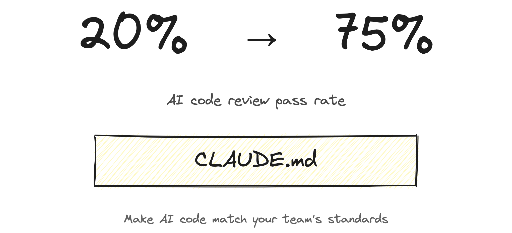
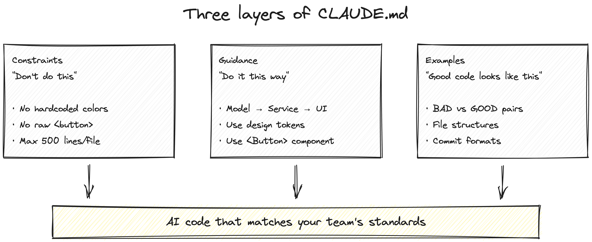
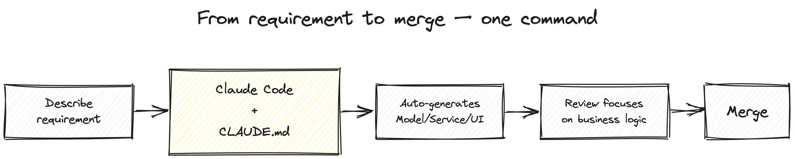

# Excalidraw Skill for Claude Code

[](LICENSE)
[](https://claude.ai/claude-code)
[](https://excalidraw.com)
[](https://playwright.dev)
[](https://nodejs.org)
[]()
[](https://github.com/anthropics/claude-code-omc)

[English](README.md)

**用自然语言在 Claude Code 中生成手绘风格图表。**

描述你想要的内容 → 自动生成带有手写字体、斜线填充、黑白极简风格的 Excalidraw PNG/SVG。



<details>
<summary>更多示例</summary>




</details>

### 技术栈

| 组件 | 技术 | 用途 |
|------|------|------|
| **技能引擎** | [Claude Code](https://claude.ai/claude-code) | AI 根据自然语言生成 Excalidraw 场景 JSON |
| **渲染器** | [Playwright](https://playwright.dev) + 无头 Chromium | 在浏览器中加载 Excalidraw，导出 PNG/SVG |
| **绘图库** | [Excalidraw](https://excalidraw.com) 0.17.6 (CDN) | 手绘风格渲染引擎 |
| **字体** | Virgil + Excalifont（内置） | 手写风格字体 |
| **Agent 编排** | [oh-my-claudecode](https://github.com/anthropics/claude-code-omc)（可选） | 多 agent 设计/审查流水线 |

### 系统要求

| 要求 | 版本 | 备注 |
|------|------|------|
| Node.js | >= 18 | 运行时 |
| Claude Code | 最新版 | CLI、桌面应用或 IDE 扩展 |
| 操作系统 | macOS / Linux | Windows 通过 WSL |
| 磁盘空间 | ~25MB | 字体文件 |

---

## 快速开始

### 方式一：一键安装（推荐）

```bash
curl -fsSL https://raw.githubusercontent.com/Minara-AI/excalidraw-skill/main/install.sh | bash
```

无需 clone 仓库，安装脚本会自动下载所有需要的文件。

### 方式二：让 Claude 自动安装

在 Claude Code 对话中直接说：

```
帮我安装 Excalidraw skill：https://github.com/Minara-AI/excalidraw-skill
```

Claude 会自动运行安装脚本，完成所有配置。

### 方式三：从本地 clone 安装

```bash
git clone git@github.com:Minara-AI/excalidraw-skill.git
cd your-project
bash /path/to/excalidraw-skill/install.sh
```

然后在 Claude Code 中，使用 `/excalidraw` 斜杠命令：

```
/excalidraw 画一个架构图，展示 Client → API Gateway → Database
```

或者直接用自然语言描述需求 — Claude 会自动识别绘图请求：

```
"帮我画一个 CI/CD 流水线的流程图"
```

就这么简单。Claude 会自动设计视觉风格、生成 `.excalidraw` JSON、渲染成 PNG、审查输出并迭代优化。

---

## 工作原理

```
第 0 步：设计阶段     — 确定视觉风格（隐喻、布局、配色）
第 1 步：生成 JSON    — Claude 编写 Excalidraw 场景 JSON
第 2 步：渲染         — Playwright 在无头 Chromium 中加载 Excalidraw → PNG/SVG
第 3 步：审查         — 从 6 个维度评分，修复问题
第 4 步：迭代         — 重新渲染直到所有评分 ≥ 7/10（最多 3 轮）
```

### 配合 oh-my-claudecode（可选）

[oh-my-claudecode](https://github.com/anthropics/claude-code-omc) 是 Claude Code 的多 agent 编排层。安装后，skill 会将专业工作委派给专门的 agent：

| Agent | 角色 |
|-------|------|
| `architect` | 绘图前设计视觉风格 |
| `critic` | 对抗审查设计方案，避免陈词滥调 |
| `designer` | 审查渲染图片的布局和比例问题 |

**不使用 OMC 时**，Claude 使用内置的 prompt 模板直接处理所有阶段。无论是否安装 OMC，skill 都完全可用。

安装脚本会在安装过程中询问是否安装 OMC。

---

## 示例

### 架构图

```
"画一个三层架构图：Model → Service → UI"
```


### 流程图

```
"画一个流水线：描述需求 → Claude Code → 自动生成 → Review → Merge"
```


---

## 渲染选项

```bash
node scripts/excalidraw/render.mjs <输入.excalidraw> <输出.png|svg> [选项]
```

| 选项 | 默认值 | 描述 |
|------|--------|------|
| `--width` | `1600` | 画布宽度 |
| `--height` | `900` | 画布高度 |
| `--scale` | `2` | 高分屏缩放倍数 |
| `--theme` | `light` | `light` 浅色 或 `dark` 深色 |

**常用尺寸：**

```bash
# Twitter 16:9（默认）
node scripts/excalidraw/render.mjs diagram.excalidraw diagram.png

# Instagram 正方形
node scripts/excalidraw/render.mjs diagram.excalidraw diagram.png --width=1200 --height=1200

# 博客头图
node scripts/excalidraw/render.mjs diagram.excalidraw diagram.png --width=1920 --height=1080

# SVG 输出
node scripts/excalidraw/render.mjs diagram.excalidraw diagram.svg
```

---

## 配置

### 输出目录

默认：`diagrams/`。修改方式：

1. 在对话中告诉 Claude：*"把图表保存到 `docs/images/`"*
2. 或在项目的 `CLAUDE.md` 中设置：

```markdown
## Diagrams
Save all generated diagrams to `docs/images/`
```

### 设计默认值

Skill 使用**黑白优先**的配色理念：

- 所有线条：黑色（`#1e1e1e`）
- 背景：透明或浅灰（`#f5f5f5`）
- 最多 1 种强调色：紫色（`#6741d9`）
- 填充样式：`hachure`（手绘斜线）
- 粗糙度：`2`（明显的手绘感）

---

## 常见问题

### Playwright 安装失败

```bash
# Linux：安装系统依赖
npx playwright install chromium --with-deps

# macOS：通常无需额外依赖
npx playwright install chromium
```

### 字体未渲染（文字看起来像系统字体）

确保 `scripts/excalidraw/` 中的字体文件是真实文件，不是 Git LFS 指针：

```bash
# 检查文件大小（应该 >1MB）
ls -la scripts/excalidraw/*.ttf

# 如果很小（<1KB），从 LFS 拉取
git lfs pull
```

### 渲染出空白图片

常见原因：

1. **元素超出视口** — 确保坐标在 0-1600 (x) 和 0-900 (y) 范围内
2. **缺少 `boundElements`** — 容器元素需要 `boundElements` 引用其文本
3. **无效的 `containerId`** — 文本的 `containerId` 必须匹配已有元素的 `id`
4. **CDN 超时** — 渲染器从 unpkg.com 加载 Excalidraw，检查网络连接

### 渲染时间过长

首次渲染可能较慢（~10秒），因为需要加载 CDN 脚本。后续渲染更快（~5秒）。

---

## 系统要求

- **Claude Code**（CLI、桌面应用或 IDE 扩展）
- **Node.js** >= 18
- **macOS** 或 **Linux**（Windows 通过 WSL）
- 约 25MB 磁盘空间（字体文件）

---

## 渲染器工作原理

渲染器（`scripts/render.mjs`）是一个自包含的 Node.js 脚本：

1. 通过 Playwright 启动无头 Chromium
2. 从 unpkg CDN 加载 React + Excalidraw
3. 以 base64 方式注入 Virgil/Excalifont 字体（避免 CORS 问题）
4. 调用 `ExcalidrawLib.exportToCanvas()` / `exportToSvg()`
5. 将结果保存为 PNG 或 SVG

除 `@playwright/test` 外无其他 npm 依赖。所有渲染都在浏览器上下文中完成。

---

## 项目结构

```
excalidraw-skill/
├── README.md              # 英文文档
├── README.zh-CN.md        # 中文文档（本文件）
├── LICENSE                # MIT 许可证
├── install.sh             # 一键安装脚本
├── skill/
│   └── SKILL.md           # Claude Code 技能定义
├── scripts/
│   ├── render.mjs         # 无头渲染器
│   ├── Virgil.ttf         # 手写字体 (1.8MB)
│   └── Excalifont.ttf     # Excalidraw 字体 (23MB)
└── examples/
    ├── three-layers.excalidraw
    ├── three-layers.png
    ├── workflow.excalidraw
    └── workflow.png
```

---

## 许可证

MIT - 详见 [LICENSE](LICENSE)

---

由 [Minara AI](https://github.com/Minara-AI) 构建
